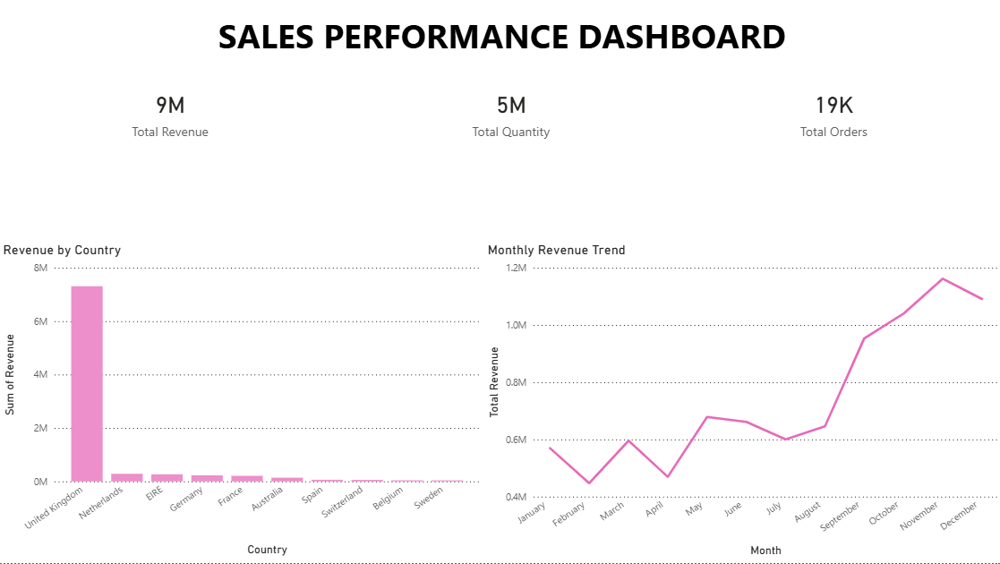

# 📊 Ecommerce Sales Analytics Dashboard (Power BI)

## 🔹 Overview

This project analyzes retail sales data to understand revenue trends, top-performing countries, and overall business performance.

## 🔹 Key Insights

* Total Revenue: 9M+
* Total Orders: 19K+
* Highest revenue from United Kingdom
* Peak sales observed in November

## 🔹 Dashboard Preview

## 🔗 Project Files

* 📊 Power BI File: https://drive.google.com/file/d/1r-ba8NPpr8NkjZYoLPVkv9fqQa5fkMp2/view?usp=drive_link
* 📁 Dataset (CSV): https://drive.google.com/file/d/1AkKLqAAXamlGbef3ZYxcpfoWxYMSnChp/view?usp=drive_link

## 🔹 Tools Used

* Power BI
* DAX
* Data Cleaning

## 🔹 Author

Evelin Rose
